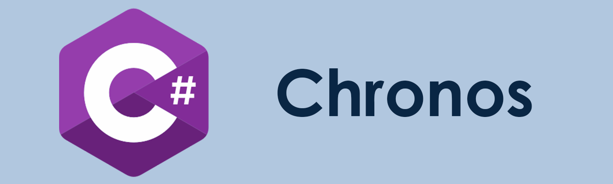

# Chronos

    

## Overview

Partial implementation of the Common Language Infrastructure (ECMA-335) written itself in C#

## Building

The *Scripts* directory contains required files for building on Windows or Linux using at least .NET 6.